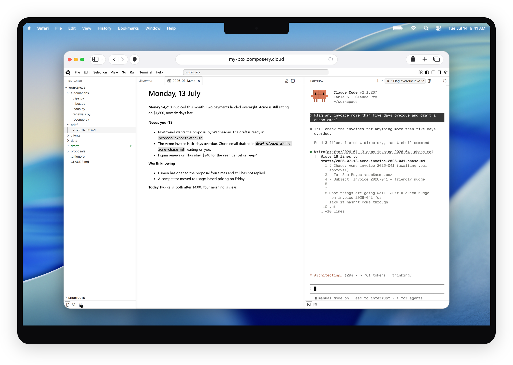
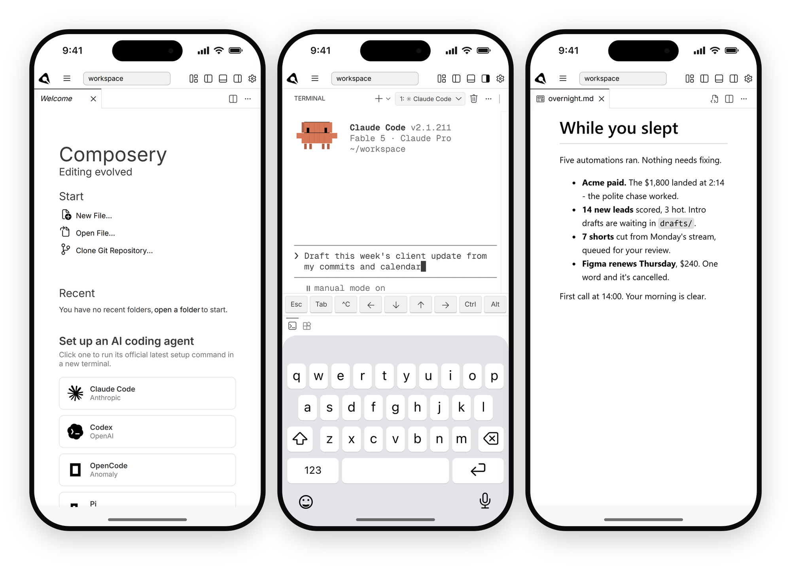

# Composery

A secure cloud computer with a powerful UI, usable from any phone or browser.

<p align="center">
  <picture>
    <source media="(prefers-color-scheme: dark)" srcset="packages/web/public/marketing/composery-ide-dark.png">
    
  </picture>
</p>

- You log in as `user` with passwordless `sudo`, not into a locked-down shell.
- The [persistence](docs/persistence.md) daemon writes your root-filesystem
  deltas to one volume at `/data`, so the container restarts like a machine
  rebooting, not like a container resetting.
- A small [automation API](docs/api.mdx) runs commands on the instance from
  `curl`, CI, or scripts, authenticated by keys you mint on the instance.
- The IDE is a self-hostable hard fork of
  [code-server](https://github.com/coder/code-server), reworked for phones,
  tablets, and long-running AI coding agents.

<p align="center">
  <picture>
    <source media="(prefers-color-scheme: dark)" srcset="packages/web/public/marketing/composery-mobile-dark.png">
    
  </picture>
</p>

## Try it

```bash
docker run -d --name composery -p 8080:8080 -v composery_data:/data \
  ghcr.io/sloikodavid/composery:latest
```

Open `http://localhost:8080/ide/` and register a password. For anything
internet-facing, put TLS in front - start at
[Self-hosting](docs/self-hosting/index.md).

## Documentation

Rendered at [composery.io/docs](https://www.composery.io/docs), source in
[`docs/`](docs/):

- [Self-hosting](docs/self-hosting/index.md) - VPS with Docker Compose,
  DigitalOcean, Fly.io, Render, Railway, Koyeb, Kubernetes, and other
  container hosts.
- [Configuration](docs/configuration.md) - runtime environment variables.
- [Persistence](docs/persistence.md) - what survives a restart and how.
- [API](docs/api.mdx) - run commands against an instance remotely.

## Composery Cloud

The hosted offering at [composery.io](https://www.composery.io/pricing) runs the same
runtime image on a dedicated VPS per instance, with HTTPS, snapshots, and lifecycle
management handled for you.

## Repository

| Path           | Contents                                                       |
| -------------- | -------------------------------------------------------------- |
| `packages/ide` | The editor: upstream code-server + our patch stack and overlay |
| `packages/cli` | The `composery` CLI and `persistence` daemon (Rust)            |
| `packages/web` | Website, docs site, and cloud backend (Next.js, Convex)        |
| `rootfs/`      | Files baked into the runtime image                             |
| `templates/`   | Ready-to-use deployment recipes for the self-hosting guides    |
| `docs/`        | The documentation rendered at composery.io/docs                |

Developing: see [docs/developing](docs/developing/index.md). Releases:
[changelog](https://github.com/sloikodavid/composery-ide/releases). Security:
[SECURITY.md](SECURITY.md). Bugs in any part of the product - image, cloud,
IDE, CLI, or site - go to
[issues](https://github.com/sloikodavid/composery-ide/issues); feature requests
and questions live in
[discussions](https://github.com/sloikodavid/composery-ide/discussions).

## License

[Apache-2.0](LICENSE). Contributions are covered by the
[CLA](.github/CLA.md).
